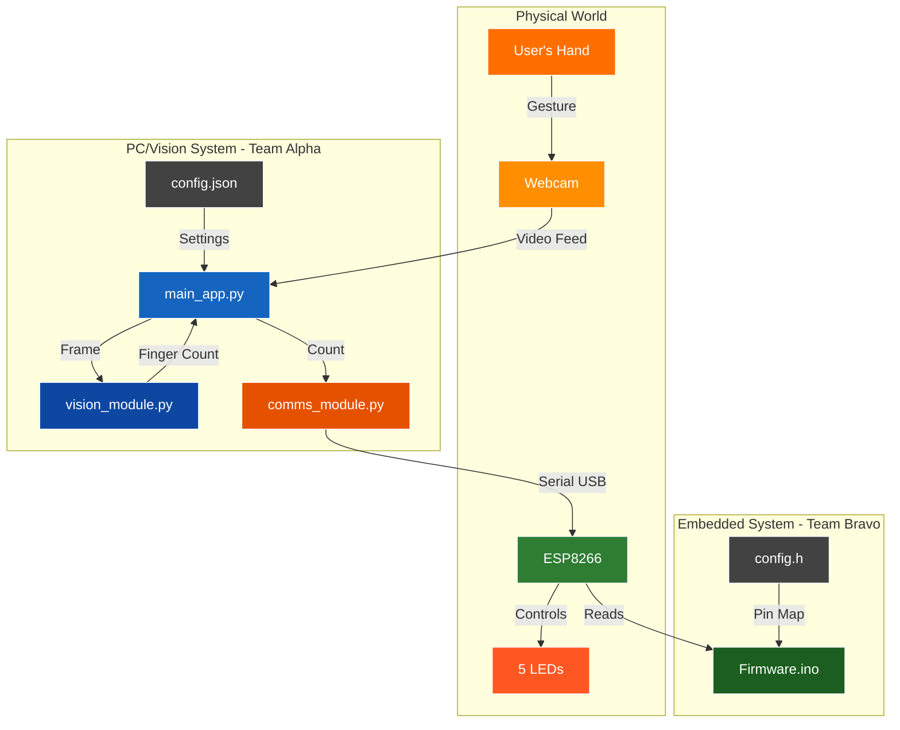
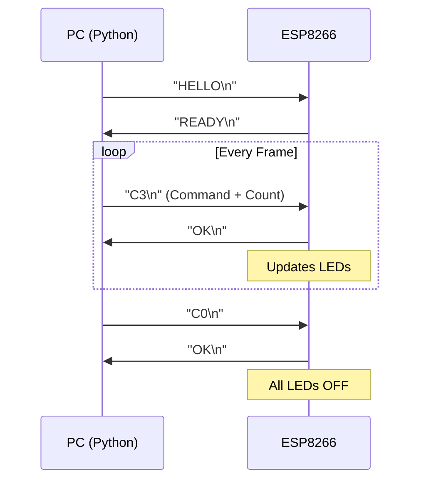
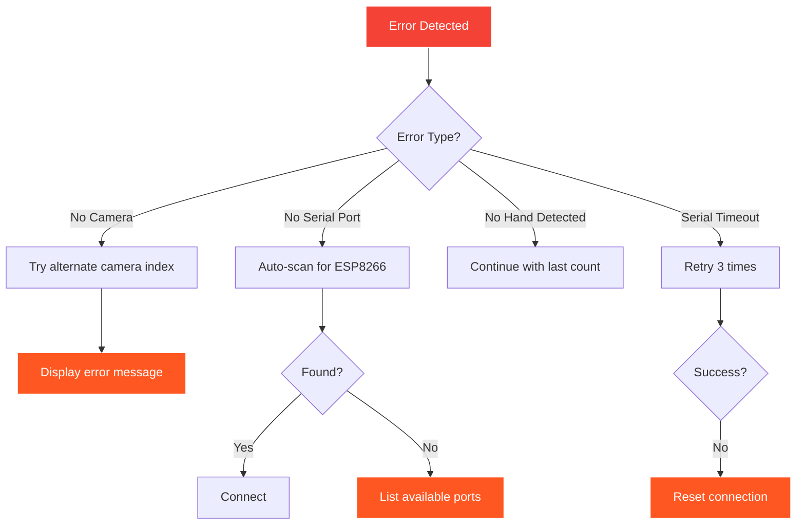

# Project Gest-LED: Master Plan & Architecture

This document provides a comprehensive overview of the Gest-LED project, including its architecture, team structure, technical contracts, and integration procedures.

## 1. Project Summary

The objective of Project Gest-LED is to create a real-time system that captures video of a user's hand, accurately counts the number of raised fingers (0-5), and displays this count by illuminating a corresponding number of LEDs. The system consists of a PC for vision processing and an ESP8266 microcontroller for hardware control, communicating via USB serial connection.

## 2. Overall Architecture

The system is divided into two primary sub-systems:
* **PC/Vision System**: A Python application for video capture, hand detection, and gesture recognition
* **Embedded/Hardware System**: An ESP8266 microcontroller for receiving commands and controlling LEDs



## 3. Team Structure & Responsibilities

### Team Alpha: PC/Vision Squad
- **Engineer A**: Vision Module Developer
  - Develops `vision_module.py` with hand detection and finger counting logic
  - Creates unit tests for vision functions
  
- **Engineer B**: Application Integration Lead
  - Develops `main_app.py` with UI and program flow
  - Integrates all modules and manages configuration
  - Leads final system integration

### Team Bravo: Embedded/Hardware Squad
- **Engineer C**: Hardware Engineer
  - Builds physical circuit with ESP8266 and 5 LEDs
  - Creates circuit documentation and pin mapping
  - Develops hardware test routines
  
- **Engineer D**: Firmware Developer
  - Develops ESP8266 firmware with serial communication
  - Creates Python `comms_module.py` for PC-side serial handling
  - Implements communication protocol

## 4. Technical Specifications

### 4.1 Communication Protocol



**Protocol Details:**
- Baud Rate: 115200
- Format: ASCII text with newline termination
- Commands:
  - `HELLO` - Initialization handshake
  - `C[0-5]` - Set LED count (C0 = all off, C5 = all on)
- Responses:
  - `READY` - ESP8266 is ready
  - `OK` - Command acknowledged
  - `ERROR` - Command failed

### 4.2 Pin Assignments (ESP8266 NodeMCU)

| LED Number | GPIO Pin | NodeMCU Label | Resistor |
|------------|----------|---------------|----------|
| LED 1      | GPIO5    | D1            | 220Ω     |
| LED 2      | GPIO4    | D2            | 220Ω     |
| LED 3      | GPIO14   | D5            | 220Ω     |
| LED 4      | GPIO12   | D6            | 220Ω     |
| LED 5      | GPIO13   | D7            | 220Ω     |

### 4.3 Configuration Files

**config.json** (PC Side):
```json
{
  "serial": {
    "port": "auto",
    "baud_rate": 115200,
    "timeout": 2
  },
  "camera": {
    "index": 0,
    "width": 640,
    "height": 480
  },
  "vision": {
    "confidence": 0.7,
    "max_hands": 1
  }
}
```

**config.h** (ESP8266 Side):
```c
#define BAUD_RATE 115200
#define LED_COUNT 5
const int LED_PINS[LED_COUNT] = {5, 4, 14, 12, 13};
```

## 5. Integration Plan

### Phase 1: Independent Development (Days 1-2)
- Each engineer develops and tests their module independently
- All modules must pass individual unit tests

### Phase 2: Sub-team Integration (Day 3)
- Team Alpha: Integrate vision_module.py with main_app.py
- Team Bravo: Test firmware with comms_module.py
- Both teams verify their subsystems work end-to-end

### Phase 3: System Integration (Day 4)
1. Team Bravo provides `comms_module.py` to Team Alpha
2. Team Alpha integrates serial communication into main_app.py
3. Both teams test complete system together
4. Debug and refine as needed

### Phase 4: Final Testing (Day 4)
- Test all finger combinations (0-5)
- Test error scenarios (no hand, multiple hands)
- Test system recovery (disconnect/reconnect)
- Performance validation (<100ms latency)

## 6. Error Handling Strategy



## 7. Testing Requirements

### Unit Tests (Each Module)
- Vision Module: Test with sample images
- Comms Module: Test with loopback serial
- Firmware: Test with serial monitor
- Hardware: Test with blink sequence

### Integration Tests
- PC Subsystem: Camera → Vision → Display
- Embedded Subsystem: Serial → Firmware → LEDs
- Full System: Hand Gesture → LED Display

### Acceptance Criteria
- ✓ System responds to all finger counts (0-5) correctly
- ✓ Latency < 100ms from gesture to LED change
- ✓ System recovers from disconnection
- ✓ Clear error messages for common issues
- ✓ Works on Windows, macOS, and Linux

## 8. Deliverables Checklist

### Team Alpha
- [ ] `vision_module.py` with hand detection functions
- [ ] `main_app.py` with complete application logic
- [ ] `test_vision.py` unit tests
- [ ] `config.json` configuration file

### Team Bravo
- [ ] Physical circuit on breadboard
- [ ] Circuit diagram (Fritzing or hand-drawn)
- [ ] `ESP_Firmware.ino` Arduino sketch
- [ ] `comms_module.py` serial communication module
- [ ] `config.h` pin configuration file
- [ ] `test_comms.py` communication tests

### Documentation
- [ ] This overview document
- [ ] Individual task sheets (A.md, B.md, C.md, D.md)
- [ ] Integration test results
- [ ] Quick start guide

## 9. Common Issues & Solutions

| Issue | Solution |
|-------|----------|
| "Port not found" | Check device manager, try "auto" mode |
| LEDs not lighting | Verify pin connections and resistors |
| Hand not detected | Ensure good lighting, adjust confidence |
| Laggy response | Reduce camera resolution in config |
| Multiple hands | System uses first detected hand only |

## 10. Success Metrics

The project is considered successful when:
1. A user can show 0-5 fingers to the camera
2. The corresponding number of LEDs illuminate within 100ms
3. The system runs continuously without crashes
4. All team members understand the complete system
5. The system can be set up on a new computer in <10 minutes
